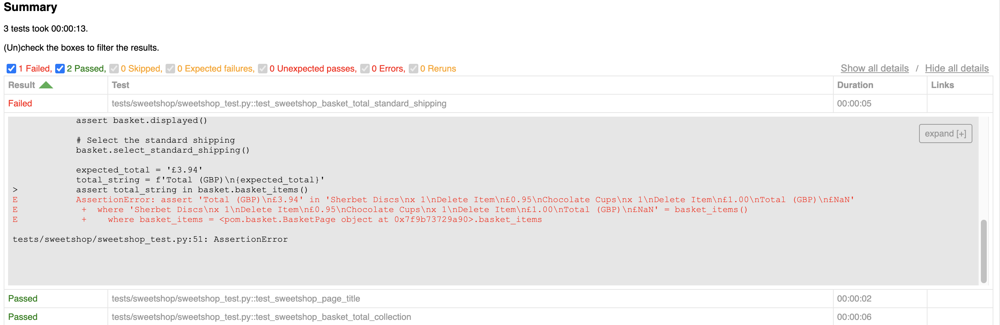
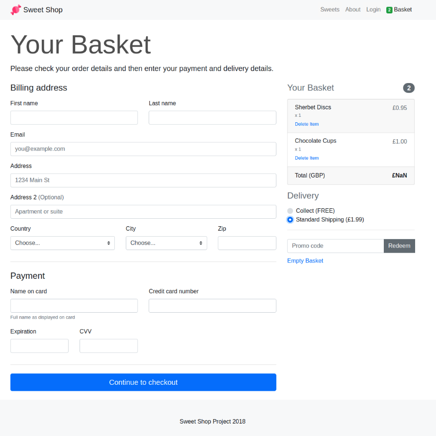

# Quality Engineer Technical Assessment - Shaun Manners

### The solution

The task is to implement a test framework in Python that will:

1. Perform UI testing against the [Sweet Shop][1] site.
2. Perform API tests against the [Airport Gap][2] API.

This framework uses:
- Docker
- Python
- Selenium WebDriver
- Google Chrome / chromedriver
- PyTest

Docker is used to provide a consistent testing environment - eliminating the 'works on my machine' scenario. The Dockerfile describes the container image to run as a VM. This image needs to be built and run in DockerDesktop for development. Docker images can also be used in Kubernetees and OpenShift, therefore, having an identical image for development is advantageous.

For this task I have used an Ubuntu base image which then has Python, Chrome and dependencies installed on it ready for running the tests. 

When running the container, the current directory (this project) is mounted as /src within the container so that source code can be edited and run 'on the fly'.

### Assumptions / Decisions

- Chrome is used as it accounts for around 66% of all browser users.
- Linux (Ubuntu) is used as the OS of choice. Partly as it's one I'm familiar with, but also for security, stability support availability.
- Both UI and API tests are in this one project, although most likely would be at different test levels and separate codebases.

## Using this framework

### Project setup

- Install Docker Desktop - available from: [Download Docker Desktop][0] (No need to create an account) and make sure it is running
- In a terminal window, clone this repo and cd into the project directory
  
```shell
git clone https://github.com/Shaun-Manners/cushon-tech-task.git
cd cushon-tech-task
```

- Build the docker image and name/tag it:

```shell
docker build . -t ubuntu-cushon:latest
```

---

### Test execution

1. Run the container and mount the current dir as a volume mapped to /src:

```shell
docker run -it -v .:/src  ubuntu-cushon:latest
```

2. Now you are inside the running container, run pytest

```shell
.venv/bin/pytest --html=reports/report.html --self-contained-html -s
```

3. Update the code as needed and re-run the tests as in step 2.

4. Run linting using PEP8 (now pycodestyle)

```shell
.venv/bin/pycodestyle ./tests
```

5. Exit the running container

```shell
exit
```

### Reports

Running pytest with the above command will result in report.html being generated in the reports folder.



### Screenshots

Screenshots are taken at key points during the tests and are stored in the /screenshots/ directory. They are given a timestamp and can be deleted before/after a test run. They can be useful for debugging purtposes as Chrome running in a Docker container has to run in headless mode. It also provides a reference to go back to.



---

### Useful Docker commands

List the images on your host system:

```shell
docker image ls
```

Delete an image:

```shell
docker image rm <image-name>
```

Remove unused images - free up disk space on the host

```shell
docker system prune
```

---

## Possible Improvements

This task is quite broad, I believe deliberately so, in which case I could continue for a while to try and 'complete' it. Below is a list of areas I'd like to improve - more than happy to discuss these!

- Use fixtures and/or json to load test data.
- Split SweetShop tests into separate files based on functionality to aid in maintaining them as more tests are added.
- Implement test region environment variable that URLs etc are based on.
- Implement cross browser/device testing.
- Docker container runs as root, not ideal!
- Dockerfile includes ENV for API token, needed to add it as an environment variable in Docker for the purposes of this task, but could be loaded from a secret in the env instead.
- Dockerfile uses Ubuntu:latest as the base, should probably be pinned to a specific version for consistency.
- Screenshots could be organised into subdirectories by test name to make them easier to locate.
- Installing FFMepeg in the container would enable rendering a video of the test exewcutions using the screenshots and timestamp data.
- Add some bash scripts for running the tests and linting, adding aliases to make running the tests a simpler/easy to remember process.
- Remove incognito argument from chrome and fix the quit/close issue I encountered.

[0]: https://www.docker.com/products/docker-desktop/#:~:text=Download%20Docker%20Desktop
[1]: https://sweetshop.netlify.app/
[2]: https://airportgap.com/